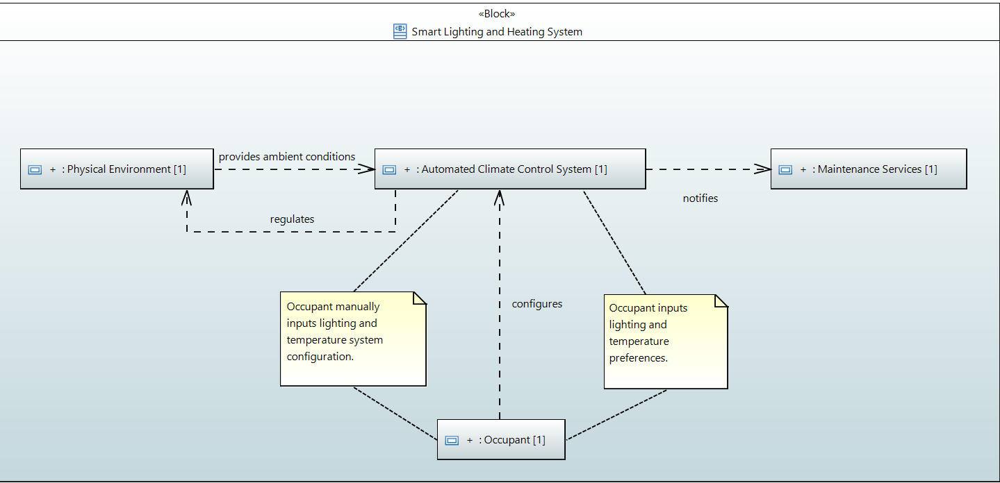
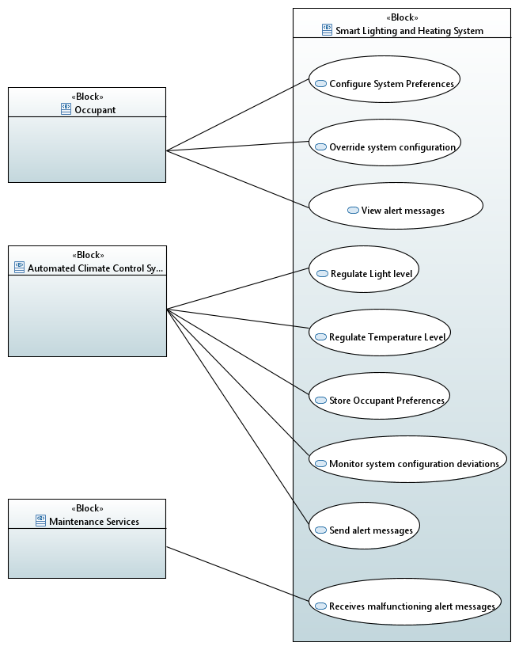

# CSLAB - First Submission

- [Requirement Specification](#requirement-specification)
  - [Black Box](#black-box)
    - [Requirements](#requirements)
    - [System Context](#system-context)
    - [Use Cases](#use-cases)
      - [Activity Diagrams](#activity-diagrams)
  - [White Box](#white-box)
    - [Functional Decomposition](#functional-decomposition)
    - [Conceptual Interfaces](#conceptual-interfaces)
    - [Conceptual Subsystems](#conceptual-subsystems)
  - [Hazard Analysis](#hazard-analysis)
- [Selected Technology](#selected-technology)
- [Physical Sensor/Actuators](#physical-sensoractuators)

## Requirement Specification

### Black Box

#### Requirements

| REQ. ID | TITLE | DESCRIPTION |
| :--- | :--- | :--- |
| **1** | **Automatic Natural Light Optimization** | While the system is in Automatic Mode, the ACCS shall adjust the smart blinds to the open position to maximize natural sunlight entry. |
| **2** | **Artificial Light Compensation** | When the natural light level, at its maximum, is measured below the user-defined threshold, the ACCS shall activate the artificial smart lights to compensate. |
| **3** | **Automatic Temperature Regulation** | While the system is in Automatic Mode, the ACCS shall modulate the smart heater output to maintain the office temperature within user preferences. |
| **4** | **User Preference Configuration** | When the Occupant inputs configuration changes via the User Interface, the ACCS shall store the new preferences for lighting and temperature. |
| **5** | **Manual Override Control** | When a manual command is received for a specific device (Blinds/Lights/Heater), the ACCS shall override the automatic control and execute the requested status change. |
| **6** | **Performance Deviation Alert** | If the measured environmental parameters deviate from the current system configuration target values for a defined duration, the ACCS shall display a warning message on the User Interface. |

#### System Context

- Components:
  - Automated Climate Control System (ACCS) [System of Interest]
  - Occupant
  - Physical Environment
  - Maintenance Services

#### Use Cases

##### Activity Diagrams

- UC - Regulate Light Level

//TODO

- UC - Regulate Temperature Level

//TODO

- UC - Override System Configuration

//TODO

---

### White Box

#### Functional Decomposition

//TODO

#### Conceptual Interfaces

//TODO

#### Conceptual Subsystems

//TODO

### Hazard Analysis

| **Hazard** | **Mitigation** |
|-----------|----------------|
| One of the smart heater actuators is malfunctioning | Identify the failure, provide user with a temporary fix (regulate by hand), and initiate a long-term fix (send message to maintenance services). |
| The smart blind actuator is stuck in the "closed" position during the day. | Detect discrepancy between command and state. Notify the occupant to manually adjust the blind and send a message to maintenance services. |
| The smart light actuator fails to switch OFF (stuck ON). | Detect continuous energy usage or light input when not requested. Notify the user to manually switch off the switch and send a message to maintenance services. |
| The smart light actuator fails to switch ON (bulb/circuit failure). | Detect lack of change in light intensity after command. Notify the user, suggest using natural light, and send a message to maintenance services. |
| The temperature sensor is malfunctioning | Implement Dual-Sensor Redundancy and Range Validation. Each sensor is checked against a realistic range. If both are valid, compare them. If the difference exceeds a threshold, disable automation, notify the occupant, and send a message to maintenance services. |
| The light sensor is malfunctioning | Implement Dual-Sensor Redundancy and Range Validation. Each sensor is checked against a realistic range. If both are valid, compare them. If the difference exceeds a threshold, disable automation, notify the occupant, and send a message to maintenance services. |

## Selected Technology

//TODO

## Physical Sensor/Actuators

//TODO
